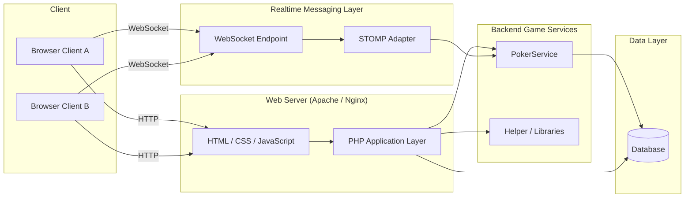

# CazitoAlpha

CazitoAlpha is the **alpha version of the Cazito multiplayer gaming platform**, built as a scalable web prototype to support real-time, multi-player gameplay. The project demonstrates a full-stack architecture combining a PHP-based web application with WebSocket-driven real-time messaging and a dedicated game service layer.

This repository represents an **early-stage system design** focused on real-time interaction, modular services, and future scalability rather than production hardening.

---

## 🚀 Overview

CazitoAlpha allows multiple players to:

- Enter a game lobby using a username
- Create or join game tables
- Participate in real-time gameplay updates across connected browsers

The system uses **WebSockets with a STOMP adapter** to synchronize game state between players in real time.

> ⚠️ This is an **alpha prototype**. Authentication, SSL WebSockets, and horizontal scaling are not yet implemented.

---

## 🧩 Key Features

- Web-based UI using **PHP, HTML, CSS, and JavaScript**
- Real-time communication using **WebSockets + STOMP**
- Modular backend game logic via a dedicated **PokerService**
- Centralized persistence layer for game and table state
- Designed to simulate multi-player behavior using multiple browser sessions

---

## 🏗 Architecture

### High-Level System Architecture

🔄 Runtime Data Flow (Example)

Player action lifecycle:

1. Player clicks an action (e.g., bet, check) in the browser
2. JavaScript sends the action via WebSocket
3. WebSocket routes the message through the STOMP adapter
4. PokerService validates and processes the action
5. Game state is updated and persisted
6. Updated state is broadcast back to all connected players
7. Browsers re-render the UI in real time

📁 Repository Structure
├── WebAlpha/        # Frontend pages and UI entry points
├── PokerService/   # Core game logic and state handling
├── Helper/         # Shared helper utilities
├── Libraries/      # Reusable and third-party libraries
├── DatabaseMgmt/   # Database access and management
├── images/         # UI and static assets
├── archive/        # Legacy or experimental code
└── README.md

🌐 Live Prototype

A hosted alpha version is available here:

🔗 https://cazito.net/WebAlpha/Pages/Home.php

Credentials

- Username: alpha
- Password: ganzania

⚠️ Browsers may display warnings due to non-SSL WebSocket connections. Follow browser prompts to continue.

🛠 Requirements

To run locally:

- Web server (Apache or Nginx)
- PHP runtime
- WebSocket support
- Database (as configured in DatabaseMgmt)
- Modern web browser

▶️ Running the Project Locally

1. Clone the repository:

git clone https://github.com/sahrahc/CazitoAlpha.git

2. Place the project in your web server’s root directory
3. Start the web server
4. Navigate to:

WebAlpha/Pages/Home.php

5. Open multiple browser windows to simulate multiple players

⚠️ Known Limitations

- No authentication or authorization
- WebSockets are not secured with SSL (wss)
- Single-server architecture
- Limited fault tolerance
- Intended for demonstration and experimentation only

📈 Scalability Roadmap (Future Work)

Planned evolution toward a production-ready system:

- Introduce authentication & session management
- Replace STOMP with Redis Pub/Sub or Kafka
- Externalize game state to Redis
- Enable horizontal scaling of game services
- Add observability (logging, metrics, tracing)
- Secure WebSocket connections (wss)

📄 License

MIT License

👤 Author

Sahrah Marcantonio
Senior Software / Data Engineer

This repository is intended as a system design and real-time architecture prototype, not a production application.

---

### ✅ Next (Optional)
If you want, I can:
- Generate a **PNG/SVG architecture diagram** to include as a fallback
- Tighten language to be **FAANG/Netflix interview optimized**
- Add **badges** (tech stack, status, license)
- Write a **“Design Decisions”** section explicitly mapping tradeoffs

Just tell me what you want to polish next.
